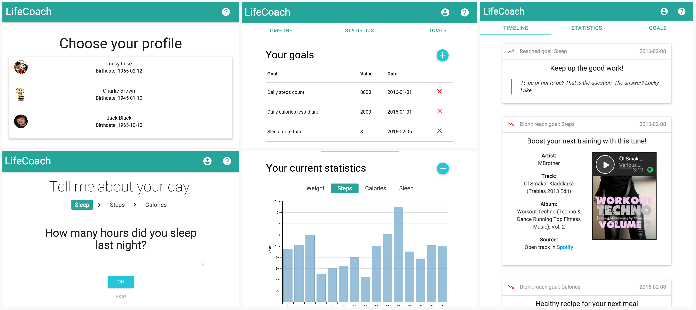
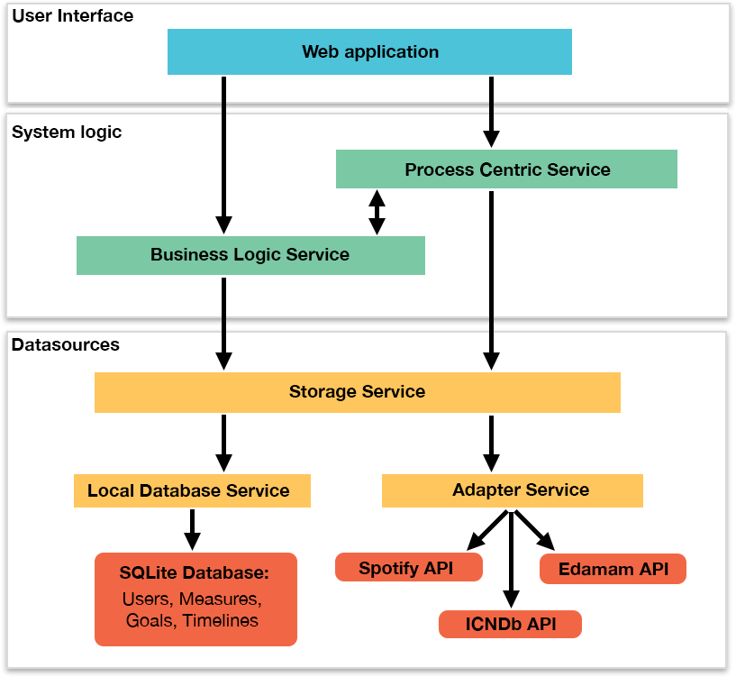

#Lifecoach web application
This project was developed as the final project for the course Introduction to Service Design and Engineering of University of Trento.  
  

##Description of the application
The Lifecoach application allows user follow his/hers health measurements and get motivational suggestions based on the performance of the user.

The application starts by picking up a dummy profile. User can then add daily measurements (steps, sleep, calories) which are saved for the user. The application visualizes the measure history of user by showing charts that show the values of the measure over time.

User can also define specific daily goals (f.ex. *”daily steps count 8000”*) that the application follows. Based on whether the goals are reached or not, the application will motivate (through jokes) or suggest actions (recipes, new music) to support user to reach the goals. These are shown in the user’s timeline.

The web application is accessible in <http://lifecoach-introsde.herokuapp.com/>.

##Application architecture
The application consists of five services that work independently. The interaction between the services are done using SOAP or REST technologies. The architecture of the application consists of following services:

* **Local Database Service:** 
 * Developed using SOAP web protocol. 
 * Interacts directly with the local SQLite database and creates the classes for all the tables.
* **Adapter Service:** 
 * Developed using REST architectural style. 
 * Responsible for interacting with external APIs, such as Spotify, Edamam and ICNDb, for requesting data through their APIs.
* **Storage Service:**
 * Developed using REST architectural style
 * Works as a middleman between the data sources and other services. Talks with the Local Database Service and Adapter Service and provides the data to other services in the application.
* **Business Logic Service:**
 * Developed using REST architectural style
 * Handles the GET/DELETE requests coming from the User Interface layer: gets requests from the UI, asks proper data from Storage Service, processes it and sends it to the UI.
 * Handles the calculations if a user has reached a goal or not: gets the posted measure from Process Centric Services, gets the person goals, makes the calculations, gets timeline item, processes it and send it back to Process Centric Service.  
* **Process Centric Service:**
 * Developed using REST architectural style
 * Handles the POST/PUT requests coming from the User Interface layer
 * Interacts with Storage Service for POST/PUT requests and Business Logic Service for checking if the user has reached its goals when new measures are posted.  
  
 

##Technological overview

**Backend programming environment**  
The backend services were built using Eclipse IDE and Java programming language.

**Local database**  
The local database was implemented using SQLite. It is a light relational database management system. SQLite does not need a database service, but it is embedded into the application.

**Frontend programming environment**  
The User Interface of the web application was developed using Sublime Text. The web application was developed using HTML5 web technologies and main programming frameworks were React, Materialize, jQuery and Sass.

**External APIs**  
* **Spotify API:** For receiving sleeping and running music tracks based on search parameters. 
* **Edamam API:** For receiving healthy recipes based on maximum calorie parameters
* **ICNDb API:** For receiving funny Chuck Norris jokes and transforming them to use the user’s name instead of Chuck Norris  

**Hosting**  
The code of all the services is hosted in **GitHub**, under [IntroSDE-2015-project organization](https://github.com/introsde-2015-final-project). Under each services GitHub repository there are also Wiki pages. Each Wiki page contains the documentation of the services API endpoints.

All the services are hosted in **Heroku**, which is a cloud platform for deploying, running and managing web applications. The user interface of Lifecoach application can be accessed [here](http://lifecoach-introsde.herokuapp.com/).

**Conclusion**  
The Lifecoach web application is a simple prototype of how this kind of health application could work. The main focus of the project was the implementation of proper service architecture behind the application, which has been done. The user can get, create, update and delete measures and goals and the requests are sent properly through the service architecture.

For future the application could be enhanced by allowing persons to create their own profiles instead of dummy ones. Moreover, instead of manually setting the daily measurements, they could be taken through other well-being services, such as Fitbit or Google Fit.

